---
types:
  - knowledge
area:
  - tech
project:
topic:
  - 设计模式
status:
  - doing
priority:
  - medium
review:
date: 2026-03-26
keywords:
tags:
  - 设计模式
aliases:
link: https://www.bilibili.com/video/BV1vNN4zaEo7/?spm_id_from=333.337.search-card.all.click&vd_source=10b3ee1feea99fbdd76960a61a32f71e
comment: true
---

# 基础

了解[UML类图](../../05%20Aechive/本科课程/大三下/软工.md#类图)

[6 分钟学会 UML 类图](https://www.bilibili.com/video/BV1Wu4y1Y7ya/?spm_id_from=333.337.search-card.all.click&vd_source=10b3ee1feea99fbdd76960a61a32f71e)

# 设计模式

## 简单工厂

将多个业务分开写成多个方法，然后在一个工厂中统一管理

### 例子

比如一个超市，有正常结账（CashNormal），有打折（CashRebate），有满减（CashReturn），在每次结账时，利用一个 `CashSuper` 创建对应的方法

三种情况都继承自 `CashFactory` 类

在使用时，在 `CashSuper` 内 `new` 出三种情况

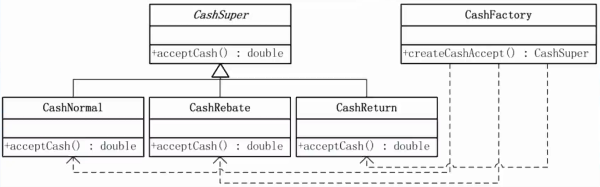

当调用时，根据不同情况，返回工厂内抽象出来的 `具体收费策略类` 

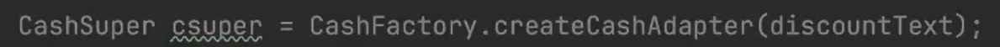 ^5185cf

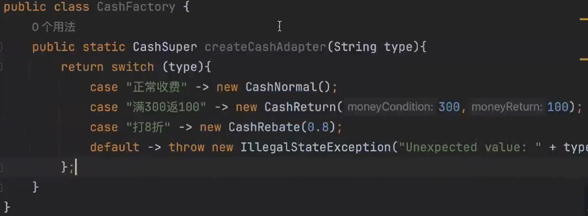

### 引出策略模式

如果要再加上积分制度，可以再在上层创建一个类，这个类内创建 `CashSuper` 和另一个积分类

可这样只解决了对象问题，可以使用**策略模式**

## 策略模式

为了封装**变化**

无论是何种情况（打折、促销），都是一种算法

**简单工厂**用工厂去生成算法

而策略模式把算法作为一种策略，算法是个**变化点**

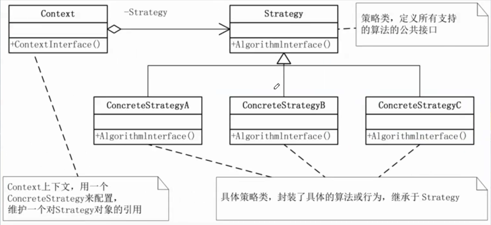

### 例子

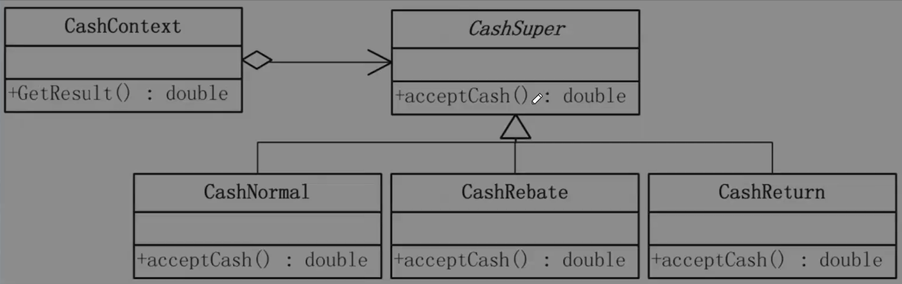

跟一开始的[简单工厂](笔记/代码设计/设计模式.md#^5185cf)相比，只需要让客户端认识一个类
- 耦合度低
- 使用成本低（只new了一个对象，且让收费算法与客户端分离，代码量都小了）

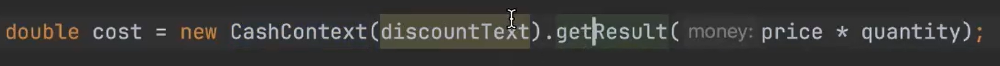

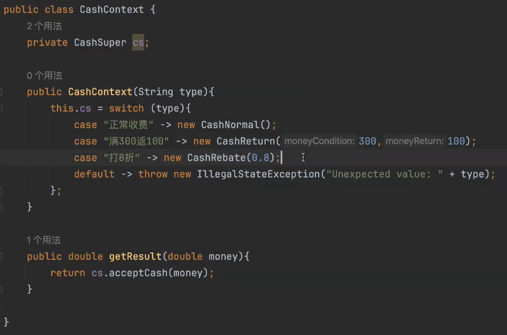

### 理解

就是再封装，把概念变化，主要可以降低耦合

通过继承的方式，在重写算法类时，既能方便的测试，还能方便的修改代码，不会影响别的算法

## 备忘录模式（快照）

字面意思，可撤回

`备忘录`：存储 `发起人` 的备忘状态

`管理者`：
- 不能访问**备忘录内容**
- 可以设置和获取备忘录

缺点：占用资源较多
 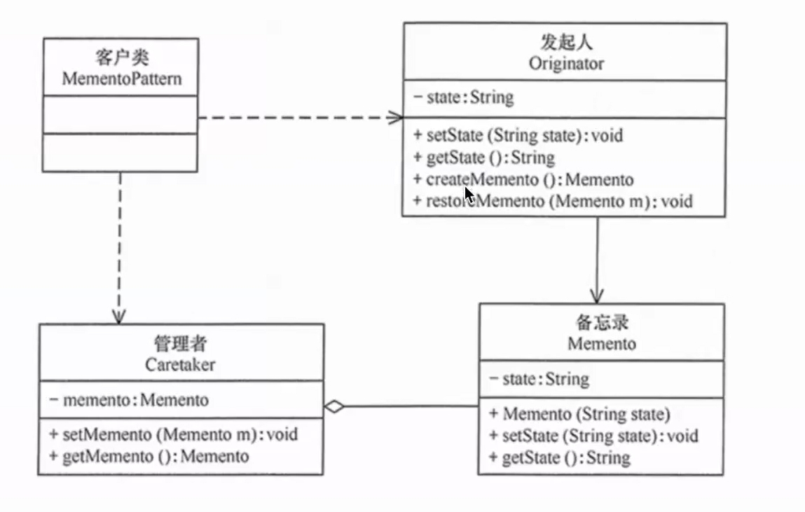

## 代理模式

定义了一个继承抽象主题的代理，来去包含真实主题

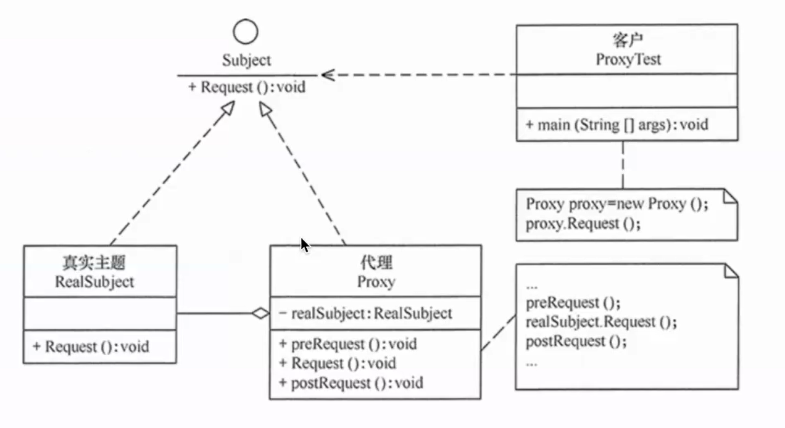

- 优点：安全
- 缺点：增加复杂度，性能影响

## 单例模式

比如win中回收站只有一个

有一个实例和全局对外访问点

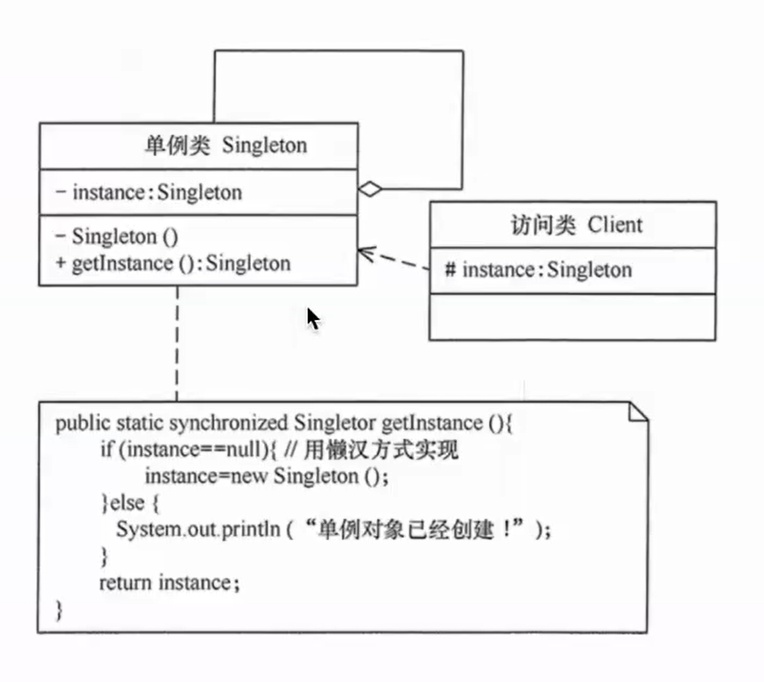
- 优点：
	- 减少重复创建，内存开销小
	- 只有一个共享访问点，优化方便
- 缺点：
	- 扩展困难
	- 并发测试中不好调
	- 功能设计要求高，因为都写在一个类里

### Lazy

如图，只有第一次调用访问点，才会创建实例

所以要注意 `synchronized` 等关键词不能少

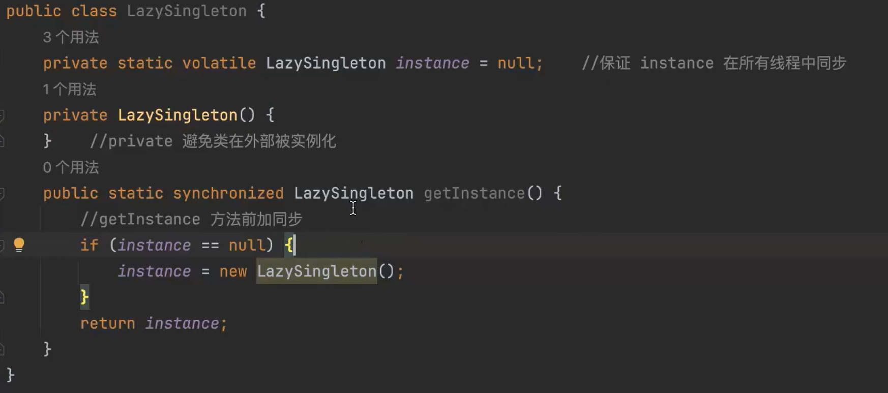

### Hungry

类创建时就创建了静态对象，是**线程安全**的 

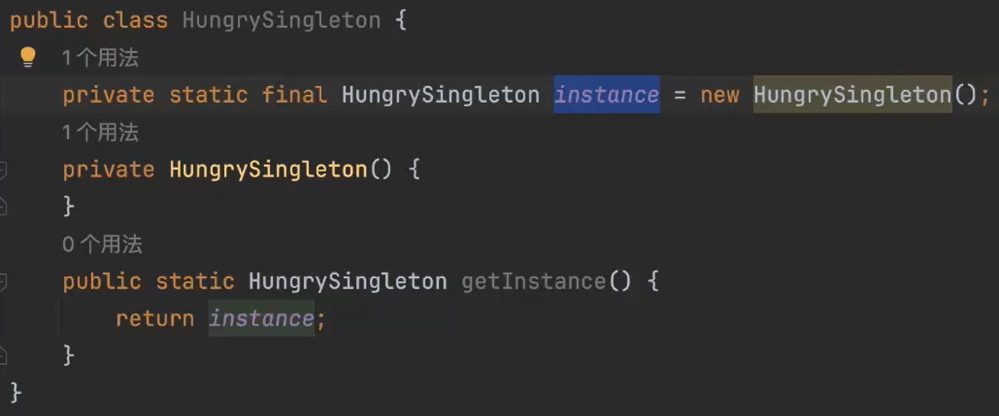

## 迭代器模式

访问聚合对象（比如链表）

既不能写在一起（修改维护不便），也不能让用户实现（增加使用负担）

具体聚合返回一个具体聚合的实例

具体迭代器完成一些具体聚合的功能

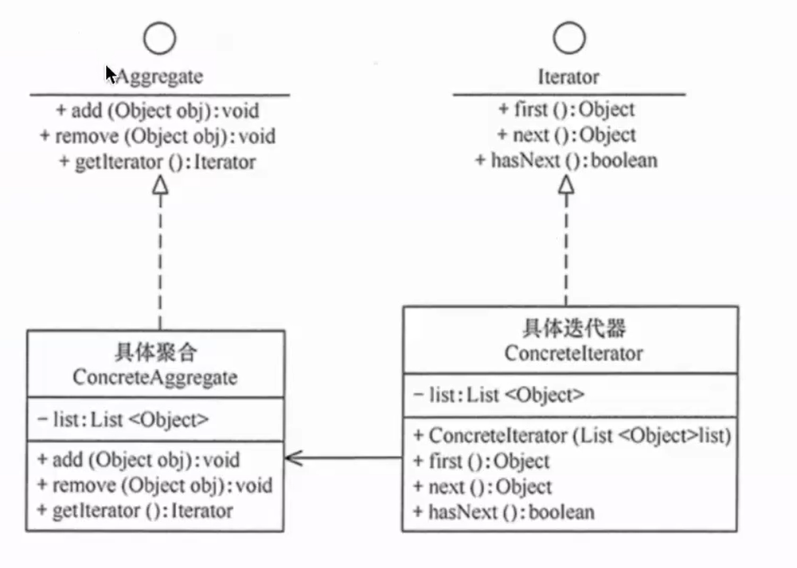

- 优点：可以以不同的迭代方式遍历聚合
- 缺点：增加了类的个数，复杂性

**日常开发中比较少**

## 访问器模式

被访问的数据相对稳定，访问对象多种多样

抽象访问者 `Visitor` 

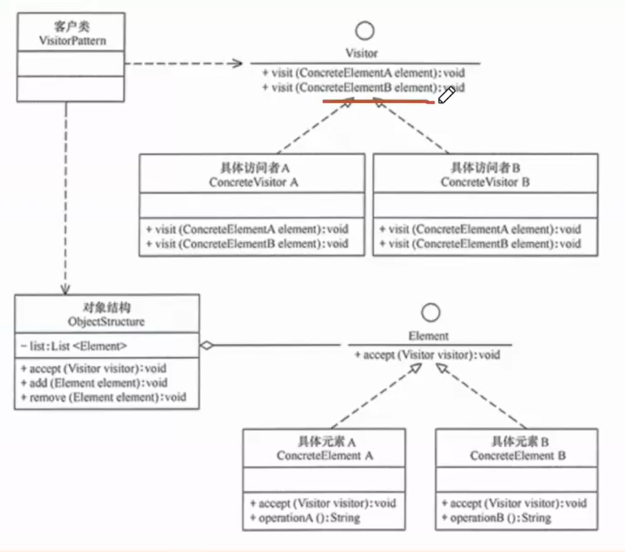

- 优点：复用效率、操作解耦、符合单一原则，每个访问者功能单一
- 缺点：增加元素比较困难、破坏了封装、违反了依赖倒置原则

## 观察者模式

