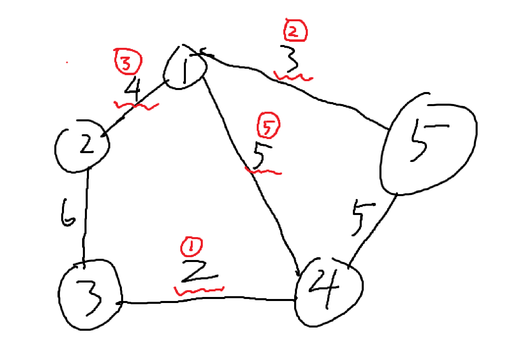

## [[最小生成树]] Kruskal 算法

edge存储边起点、终点、边权

fa[x]存储x的父节点

1、先初始化父节点

2、按边的权排序(贪心思想)

3、如果不在同一集合内，把这条边加入最小生成树，并且合并两个集合，反之就跳过

4、最后根据连接的点是否是顶点的个数减一确定能否生成最小生成树


如下图，红色表示取的边和次序，先取最小的2，再3，再4最后5，此时成为生成树，并且为最小生成树




**核心步骤**：

```C++
//存储边和权
struct edge {
    int u, v, w;
    //重载运算符，排序时使用
    bool operator<(const edge& t) 
    { return w < t.w; }
}e[N];
//并查集
int fa[N];
//     输入时要用uvw，n为顶点数，m为边数，cnt为当前已经连上的边
int ii,u, v, w,       n,    m,  cnt = 0;
int ans = 0;
//并查集寻父
int find(int x) {
    if (fa[x] == x)return x;
    else return fa[x] = find(fa[x]);
}
bool kruskal() {
    //先排序
    sort(&e[1], &e[1 + m]);
    int x, y;
    rep(ii, 1, m + 1) {
        x = find(e[ii].u);
        y = find(e[ii].v);
        //如果不在同一集合中
        if (x != y) {
            //合并集合
            fa[x] = y;
            cnt++;
            ans += e[ii].w;
        }
    }
    if (cnt == n - 1) return true;
    return false;
}
```

### **例题**：

口袋的天空https://www.luogu.com.cn/problem/P1195